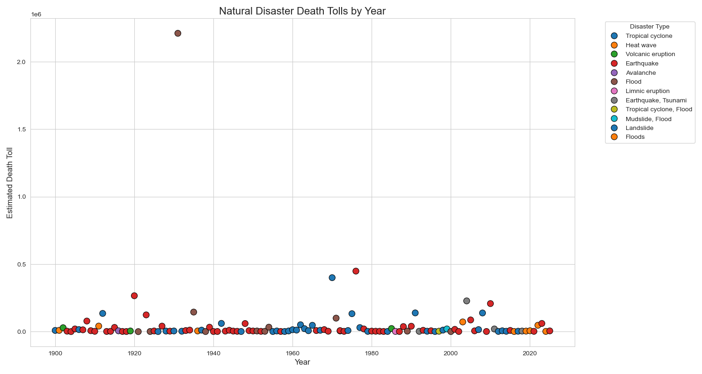
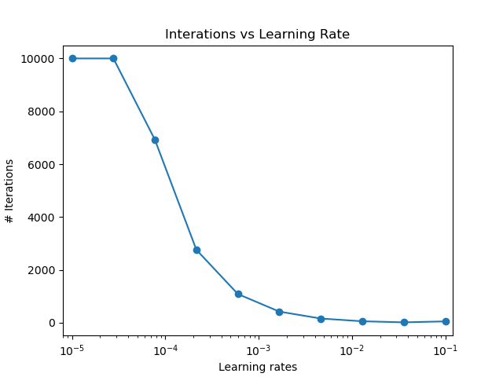
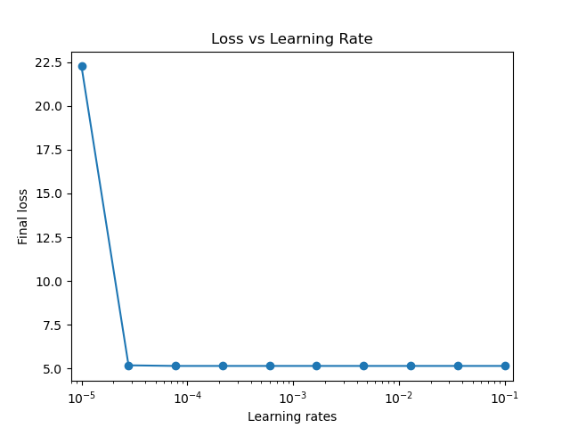

All codes are run within the environment specified in **environment.yml**.

## Q1

The scatterplot shows the number of people estimated to have died in different natural disaster events from around 1900 to 2025.
Each dot represents a specific disaster, its position on the x-axis represents the year it occurred in, and the height on the y-axis showing the number of deaths. For example, the dot with the highest position on the y-axis represents the Spanish flu in 1920, with an estimated number of death of over 50 million people. 
The color of each dot indicates the type of disaster, such as earthquake, flood, or cyclone. Sometimes the death count was caused by a combination of disasters of different types, and such combincations are preserved as their own categories. A few disaster types demonstrated extremely high death tolls over multiple occurrences, such as famines (in green) and disease outbreaks (in dark brown).
 
## Q2
| Plot 1 | Plot 2 |
|--------|--------|
|  |  |

The figures show the result of simulating gradient descent with different learning rates, generated on a log scale.

The learning rate controls how fast the algorithm reaches convergence. The algorithm will take extra iterations to converge if a small learning rate is supplied. In the simulation, the smallest learning rate tested did not lead to algorithm convergence in 10,000 iterations, which was set to be the maximum iterations allowed in this scenario. The algorithm's loss also remained high at iteration = 10,000. When the learning rate increases, the number of iterations it takes for gradient descent to converge decreased. With learning rates generated on a log scale in this simulation, the number of iterations went through a drastic decrease first then gradually converged. Final loss at algorithm convergence did not differ.

The algorithm fails under numerical instability caused by a learning rate too large. When e is large, as we iterate through the algorithm the gradient grows large quickly eventually causing an overflow. When an overflow happens an 'inf' value is assigned and subsequent computations fail leading to a failure in the algorithm.
